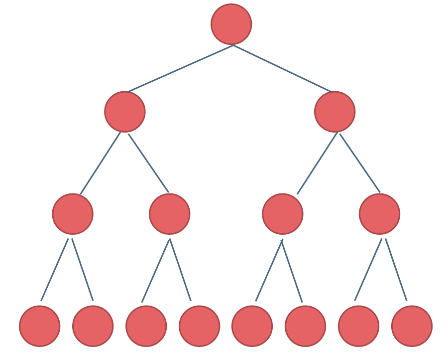
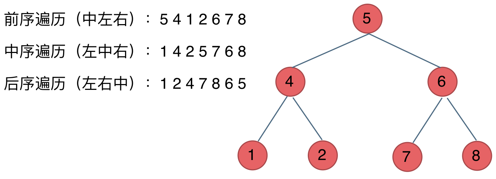

# 二叉树理论基础篇
---
### 题目大纲


### 二叉树的种类

---
主要分为
- 满二叉树
- 完全二叉树
#### 满二叉树

如果一颗二叉树只有**度为0**的节点和**度为2**的节点，并且在度为0的节点在同一层，则这颗二叉树为满二叉树。



这里的度和图论的有细微差别，图论里的度指的一个node有多少条边，二叉树的度直接指他拥有子节点的个数。

在二叉树中：

- 深度（depth）：从根节点开始算起，根的深度是 0，根的孩子是 1，以此类推。
- 高度（height）：从根到叶子最长的路径长度（很多地方深度和高度会混用，但这里用“深度为 k”通常指从 0 开始数到第 k 层）。

上面这张图即为满二叉树，又可以说深度为$k$，有$2^k-1$个节点的二叉树。

#### 完全二叉树

在完全二叉树中，只有最底层的节点可能没填满，其他层全都达到最大值，并且最下面一层的节点都集中在该层最左边的若干位置。

若最底层为第 h 层（h从1开始），则该层包含 $1 \to 2^{h-1}$ 个节点。


堆就是一棵完全二叉树

#### 平衡搜索二叉树

平衡二叉搜索树：又被称为AVL（Adelson-Velsky and Landis）树，且具有以下性质：它是一棵空树或它的左右两个子树的高度差的绝对值不超过1，并且左右两个子树都是一棵平衡二叉树。


### 二叉树储存方式

---

二叉树既可以链式储存，也可以顺序储存。

链式储存用链表，顺序储存用数组。

顾名思义就是顺序存储的元素在内存是连续分布的，而链式存储则是通过指针把分布在各个地址的节点串联一起。

链式存储如图：


链式存储是大家很熟悉的一种方式，那么我们来看看如何顺序存储呢？

其实就是用数组来存储二叉树，顺序存储的方式如图：


数组存储主要适用于完全二叉树

用数组来存储二叉树如何遍历的呢？

**如果父节点的数组下标是 i，那么它的左孩子就是 i * 2 + 1，右孩子就是 i * 2 + 2。**

### 二叉树的遍历方式

---

二叉树主要有两种遍历方式：

1. 深度优先遍历：先往深走，遇到叶子节点再往回走。
   - 前序遍历（递归法，迭代法，最常用）
   - 中序遍历（递归法，迭代法）
   - 后序遍历（递归法，迭代法）
2. 广度优先遍历：一层一层的去遍历（迭代法）。

在深度优先遍历中：有三个顺序，前中后序遍历，这里前中后，其实指的就是**中间节点的遍历顺序**，只要记住 前中后序指的就是中间节点的位置就可以了。



### 二叉树的定义

顺序储存就是用数组，这没什么好说的，链式储存的二叉树节点定义方式如下：

```python
    class TreeNode
        def __init(self,val=0,left=None,right=None)
            self.val    = val
            self.left   = left
            self.right  = right
```

相比链表二叉树多了一个指针，分别指向左右孩子

